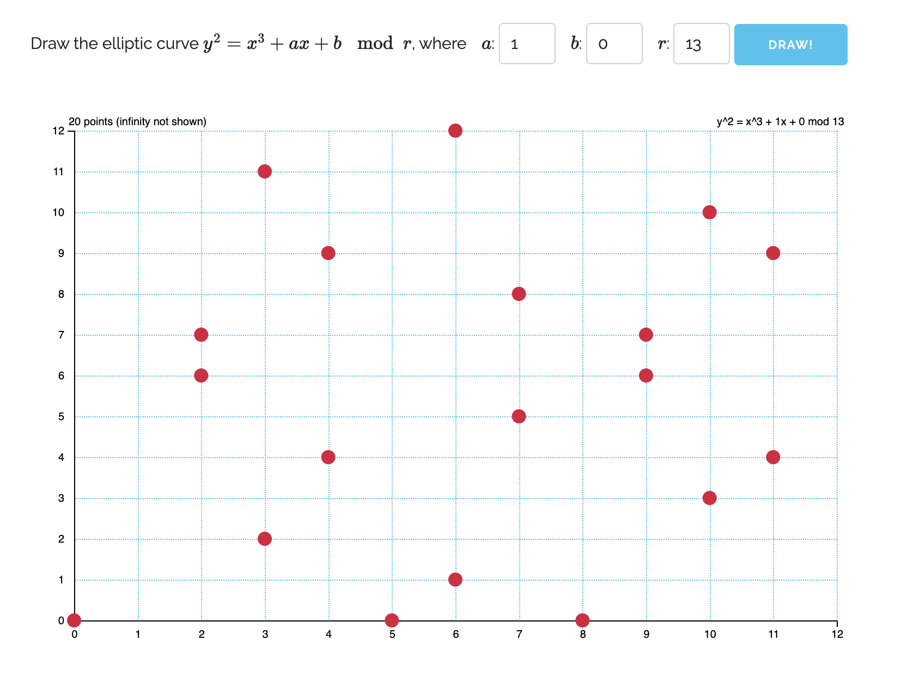

# section 03: elliptic curves and secp256k1

## elliptic curves

elliptic curves are described by this general equation:

`y^2 = x^3 + ax + b`


## infinite vs finite fields

first, what is a field? 

a field is nothing more than a set where both
the additive and multiplicative operations are
defined.

ok, so a infinite field is an infinite set of numbers
where + and * are defined, like the naturals, integers,
rationals...

but what is a finite field?

well, it must follow that a finite field is a
set that is **finite** where + and * are defined,
but not in the way tradicional arithmetic, over
an infinite field, is defined. the number of
elements in the field is called it's _order_,
denoted by _p_.

as an example, here's a finite field with p=4:

`[1, 2, 3, 4]`

let _a_ and _b_ be any element of the field above.

addition is defined such that

`a + b = (a + b) mod p`

visually, you can imagine that when field overflows, it wraps back to the 
beginning. so what the modulo operator does is removes multiples of _p_ 
from the sum and returns only the rest.

ok, so let's add 2, 3 and 4 in this field. addition is defined
as the mod p of the sum:

`(2 + 3 + 4) mod 4 => 9 mod 4 => 1`

## elliptic curves over finite fields

an elliptic curve:\
`y^2 = x^3 + ax +b`

over the finite field $F_p$:\
`[1, ...p]`

with parameters:\
`a = ?`\
`b = ?`\
`p = ?`

when you plot an EC over a finite field, it ceases being continuous and
becomes a discrete curve. it ceases to be symmetric about the x-axis and
becoms symmetric about `p/2`.

below is an EC with `a=1, b=0 and p=13`:



notice how the axis of symmetry is at `y=6.5`, which is exactaly `13/2`

## secp256k1

the EC bitcoin uses is called secp256k1. it's parameters are 
defined in [this paper](https://secg.org/sec2-v2.pdf) by
Certicom Research, dated Jan 2010. satoshi probably worked off
of a preprint, given that the 
[whitepaper](https://luisschwab.net/bitcoin-whitepaper.pdf)
dates Oct 2008.

in the paper, secp256k1 has it's parameters set to:

```
p = FFFFFFFF FFFFFFFF FFFFFFFF FFFFFFFF 
    FFFFFFFF FFFFFFFF FFFFFFFE FFFFFC2F

  = 2^256 - 2^32 - 2^9 - 2^8 - 2^7 - 2^6 - 2^4 - 1

a = 00000000 00000000 00000000 00000000 
    00000000 00000000 00000000 00000000

b = 00000000 00000000 00000000 00000000 
    00000000 00000000 00000000 00000007

// base point (compressed form)
G = 02 79BE667E F9DCBBAC 55A06295 CE870B07 
       029BFCDB 2DCE28D9 59F2815B 16F81798

// base point (uncompressed form)
G = 04 79BE667E F9DCBBAC 55A06295 CE870B07 
       029BFCDB 2DCE28D9 59F2815B 16F81798 
       483ADA77 26A3C465 5DA4FBFC 0E1108A8 
       FD17B448 A6855419 9C47D08F FB10D4B8

// order n of G
n = FFFFFFFF FFFFFFFF FFFFFFFF FFFFFFFE 
    BAAEDCE6 AF48A03B BFD25E8C D0364141

  = 11579208923731619542357098500868790
    78528375642790749043826051631415181
    61494337

// cofactor
h = 01
```

so the EC in specific form will be `y^2 = x^3 + 7`

but what does `G` and `n` mean?

## generator point G, and order n of G

given a generator point `G`, and a private key `k`,
the corresponding public key is derived by 
this equation: `P = k * G`.

but what about `n`?

`n` is the number of times you can add `G` to itself before
the finite field _runs out_, such that `n * G = G`. therefore,
`n` must be smaller than the _order_ of the finite field `p`,
such that `n < p`.

note that the privkey `k` is a scalar, but the public key `kG`
is a point (x, y) on the EC.


## compressed and uncompressed point encodings

### uncompressed form

given the generator point `G` defined in secp256k1:

```
G = 04 79BE667E F9DCBBAC 55A06295 CE870B07 
       029BFCDB 2DCE28D9 59F2815B 16F81798 
       483ADA77 26A3C465 5DA4FBFC 0E1108A8 
       FD17B448 A6855419 9C47D08F FB10D4B8
```

the first byte (`04`) indicates uncompressed form (versus `02` and `03`
indicating compressed form).

the other 64 bytes are split between `x` and `y` coordinates:

```
x: 79BE667E F9DCBBAC 55A06295 CE870B07 
   029BFCDB 2DCE28D9 59F2815B 16F81798

y: 483ADA77 26A3C465 5DA4FBFC 0E1108A8 
   FD17B448 A6855419 9C47D08F FB10D4B8
```

### compressed form

in compressed form, only the `x` coordinate is present:

```
G = 02 79BE667E F9DCBBAC 55A06295 CE870B07 
       029BFCDB 2DCE28D9 59F2815B 16F81798

parity: 02

x: 79BE667E F9DCBBAC 55A06295 CE870B07 
   029BFCDB 2DCE28D9 59F2815B 16F81798

x: 55066263022277343669578718895168534326250603453777594175500187360389116729240
```

since the EC over $F_p$ is symmetric, every point has a sort of "conjugate",
like in complex numbers, except that the axis of symmetry is `y=p/2`. so in 
order to find the value of `y`, we need to figure out which point the compressed
form is refers to. that's where the parity value comes in. it can have values of
`02` or `03`:

`02`: the point will be the "conjugate" with an even value of `y`

`03`: the point will be the "conjugate" with an odd value of `y`


but how do we calculate values of `y`?

simple, just use the EC equation from above: `y^2 = x^3 + 7`

`y^2` will yield:\
`y^2 = 55066263022277343669578718895168534326250603453777594175500187360389116729240`

but remember, we're doing finite field math, so: `y^2 = (y^2) mod p`

this will yield:\
`y^2 = 32748224938747404814623910738487752935528512903530129802856995983256684603122`

but we want `y`, and we can't just do $\sqrt{y^2}$, since we're on a finite field.

to calculate `y` on _secp256k1_ specifically, we use 
[this trick](https://crypto.stackexchange.com/questions/82027/is-it-possible-to-compute-the-y-coordinate-of-a-point-on-secp256k1-given-only-t/98364#98364).

in python, this translates to:

```py
y = pow(y^2, (p+1)//4, p)
```

in our case, this yields\
`y = 32670510020758816978083085130507043184471273380659243275938904335757337482424`,

which is even, just like `02`, the parity byte.

but what if the parity byte had a value of `03`?

to do that, we find the additive inverse of `y` on the finite field:
`y = p - y`

the other `y` will have a value of\
`y = 83121579216557378445487899878180864668798711284981320763518679672151497189239`

that's it.